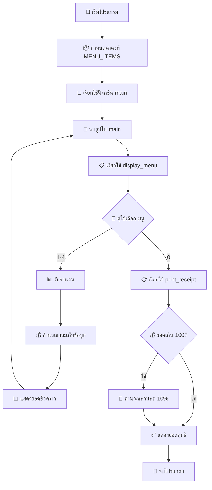

# ☕ Zodiac Cafe POS System V5

<div align="center">


**🎯 ระบบขายสินค้าร้านกาแฟขั้นสูง (Refactored with Functions)**

*พัฒนาด้วยภาษา Python แบบ Modular Design สำหรับการเรียนรู้และใช้งานจริง*

</div>

---

## 📋 รายละเอียดโปรแกรม

โปรแกรม **Zodiac Cafe POS V5** เป็นระบบจุดขายสินค้า (Point of Sale) ที่ได้รับการปรับปรุงด้วยการแบ่งโครงสร้างเป็นฟังก์ชัน (Function-Based Architecture) สำหรับร้านกาแฟ รองรับการสั่งซื้อหลายรายการ คำนวณยอดรวม และมีระบบส่วนลดโปรโมชั่น พร้อมโครงสร้างโค้ดที่สะอาดและง่ายต่อการบำรุงรักษา

## ✨ คุณสมบัติเด่น (อัพเดต V5)

### 🏗️ Architecture & Code Quality
- 🔧 **Function-Based Design** - โครงสร้างโค้ดแบบ Modular ที่แบ่งแยกหน้าที่ชัดเจน
- 📝 **Clean Code Principles** - โค้ดที่อ่านง่าย บำรุงรักษาง่าย และขยายได้
- 📚 **Documentation** - มี Docstring อธิบายหน้าที่ของแต่ละฟังก์ชัน
- 🎯 **Separation of Concerns** - แยกส่วนข้อมูล, ฟังก์ชัน, และ main logic ออกจากกัน

### 💼 Business Features
- 🍵 **แสดงรายการเมนู** - เมนูกาแฟครบครันพร้อมราคาที่ชัดเจน
- 🛒 **สั่งซื้อหลายรายการ** - สามารถสั่งซื้อสินค้าหลายรายการพร้อมจำนวนต่างๆ
- 💰 **คำนวณราคาแบบเรียลไทม์** - แสดงยอดชั่วคราวทุกครั้งที่เพิ่มรายการ
- 📋 **ระบบบิลรายละเอียด** - แสดงรายการสั่งซื้อพร้อมราคาต่อหน่วยและจำนวน
- 🎁 **ระบบส่วนลดโปรโมชั่น** - ส่วนลด 10% สำหรับยอดซื้อเกิน 100 บาท
- ✅ **ตรวจสอบข้อมูลป้อนเข้า** - ป้องกันการป้อนข้อมูลผิดพลาด
- 🔄 **สั่งซื้อต่อเนื่อง** - สามารถเพิ่มรายการสินค้าได้หลายครั้งในบิลเดียว

## 📖 รายการเมนู

<div align="center">

| 🔢 เลขที่ | ☕ เมนู | 💵 ราคา (บาท) |
|:--------:|:------:|:------------:|
| **1** | 🇺🇸 Americano | **55.75** |
| **2** | 🥛 Latte | **60.15** |
| **3** | ⚡ Espresso | **50.15** |
| **4** | 🎨 Cappuccino | **65.00** |

</div>

## 🚀 วิธีการใช้งาน

```bash
# 1️⃣ รันโปรแกรม
python Cafe.py

# 2️⃣ เลือกเมนูที่ต้องการ (1-4)
# 3️⃣ ระบุจำนวนที่ต้องการสั่งซื้อ
# 4️⃣ ทำซ้ำขั้นที่ 2-3 สำหรับรายการอื่นๆ
# 5️⃣ กด 0 เพื่อคิดเงินและดูบิลรายละเอียด
```

## 📁 โครงสร้างไฟล์

```
Simple Cafe POS/
├── 📄 Cafe.py          # ไฟล์หลักของโปรแกรม
└── 📄 README.md        # เอกสารประกอบโปรแกรม
```

## 🎬 ตัวอย่างการใช้งาน

<div align="center">

```console
Welcome to the Zodiac Cafe POS V5
กรุณาเลือกรายการที่ต้องการ (กด 0 เพื่อคิดเงิน)
1. Americano 55.75 บาท
2. Latte 60.15 บาท
3. Espresso 50.15 บาท
4. Cappuccino 65.00 บาท

------------------------------
กรุณาเลือกเมนู (1-4) หรือ 0 เพื่อสรุปยอด: 2
กรุณาระบุจำนวน: 2
เพิ่ม 'Latte x2' เรียบร้อย
ยอดชั่วคราว: 120.30 บาท

------------------------------
กรุณาเลือกเมนู (1-4) หรือ 0 เพื่อสรุปยอด: 1
กรุณาระบุจำนวน: 1
เพิ่ม 'Americano x1' เรียบร้อย
ยอดชั่วคราว: 176.05 บาท

------------------------------
กรุณาเลือกเมนู (1-4) หรือ 0 เพื่อสรุปยอด: 0

========================
        รายการสั่งซื้อ (บิล)
------------------------
- Latte x2 (หน่วยละ 60.15) 	= 120.30 บาท
- Americano x1 (หน่วยละ 55.75) 	= 55.75 บาท
------------------------
ยอดรวมทั้งหมด : 176.05 บาท
ส่วนลด 10% : -17.61 บาท
ยอดสุทธิที่ต้องชำระ: 158.44 บาท

ขอบคุณที่มาใช้บริการครับ
========================
```

</div>

## 🏗️ โครงสร้างโค้ด V5 (Function-Based)

<div align="center">



</div>

### 🔧 Function Architecture

#### 📚 **Core Functions**
- 🎯 **`main()`** - ฟังก์ชันหลักควบคุมการทำงานทั้งหมด
- 📋 **`display_menu(menu)`** - แสดงรายการเมนูแบบมีพารามิเตอร์
- 🧾 **`print_receipt(order_list, total)`** - พิมพ์ใบเสร็จพร้อมคำนวณส่วนลด

#### 💾 **Data Structure**
- 🏷️ **`MENU_ITEMS`** - Constants เก็บรายการเมนูในรูปแบบ List of Dictionaries
- 📦 **`order_list`** - เก็บรายละเอียดทุกรายการที่สั่งซื้อ
- 💰 **`running_total`** - ยอดรวมสะสม

#### ✨ **Code Quality Features**
- 📚 **Docstring** - ทุกฟังก์ชันมีคำอธิบายหน้าที่
- 🎯 **Single Responsibility** - แต่ละฟังก์ชันทำหน้าที่เดียว
- 🔄 **Reusability** - ฟังก์ชันสามารถนำไปใช้ซ้ำได้
- 📝 **Maintainability** - โค้ดแยกส่วนชัดเจน ง่ายต่อการแก้ไข

## 🆕 อัพเดตใหม่ในเวอร์ชัน V5

<div align="center">

| 🎯 ฟีเจอร์ใหม่ V5 | 📝 รายละเอียด | 🔧 ประโยชน์ |
|:----------:|:----------:|:----------:|
| 🏗️ **Function-Based Architecture** | แบ่งโค้ดเป็นฟังก์ชันย่อยๆ | เข้าใจง่าย บำรุงรักษาง่าย |
| 📚 **Docstring Documentation** | เพิ่มคำอธิบายในแต่ละฟังก์ชัน | โค้ดมีคุณภาพสูง |
| 🎯 **Separation of Concerns** | แยกหน้าที่ของแต่ละส่วนชัดเจน | พัฒนาต่อได้ง่าย |
| 🔄 **Code Reusability** | ฟังก์ชันสามารถใช้ซ้ำได้ | ลดการเขียนโค้ดซ้ำ |
| 📦 **Modular Design** | โครงสร้างแบบโมดูลาร์ | ขยายฟีเจอร์ได้ง่าย |
| 🔧 **Easy Maintenance** | แก้ไขโค้ดได้ง่ายขึ้น | ลดเวลาพัฒนา |

</div>

### 📈 การปรับปรุงจาก V4 → V5

<div align="center">

| 🔄 ส่วนที่ปรับปรุง | ❌ V4 | ✅ V5 |
|:----------:|:----------:|:----------:|
| **โครงสร้างโค้ด** | โค้ดยาวในฟังก์ชันเดียว | แบ่งเป็นฟังก์ชันย่อย |
| **การแสดงเมนู** | โค้ดในลูป main | ฟังก์ชัน `display_menu()` |
| **พิมพ์ใบเสร็จ** | ผสมกับ main logic | ฟังก์ชัน `print_receipt()` |
| **ความซับซ้อน** | ยากต่อการเข้าใจ | ง่ายต่อการเข้าใจ |
| **การบำรุงรักษา** | ยากในการแก้ไข | ง่ายในการแก้ไข |
| **การขยาย** | ยากในการเพิ่มฟีเจอร์ | ง่ายในการเพิ่มฟีเจอร์ |

</div>

## 🔧 ความต้องการระบบ

<div align="center">

| 🛠️ เครื่องมือ | 📋 รายละเอียด |
|:----------:|:----------:|
| 🐍 **Python** | เวอร์ชัน 3.x ขึ้นไป |
| 📚 **ไลบรารี** | ไม่ต้องติดตั้งเพิ่มเติม (ใช้ built-in functions) |
| 💻 **OS** | Windows, macOS, Linux |
| 💾 **RAM** | 1 GB ขึ้นไป |
| 💿 **Storage** | 10 MB ขึ้นไป |

</div>

## 🚀 การพัฒนาในอนาคต

<div align="center">

| 🎯 ฟีเจอร์ | 📝 รายละเอียด | 🔥 ความสำคัญ |
|:--------:|:----------:|:----------:|
| 💳 **ระบบชำระเงิน** | รองรับการชำระเงินหลายช่องทาง | 🔥🔥🔥 |
| 📦 **จัดการสต็อก** | ตรวจสอบและจัดการสินค้าคงคลัง | 🔥🔥🔥 |
| 🗄️ **ฐานข้อมูล** | เก็บข้อมูลการขายและลูกค้า | 🔥🔥 |
| 👥 **ระบบสมาชิก** | สะสมแต้มและส่วนลดสำหรับสมาชิก | 🔥🔥 |
| 🧾 **พิมพ์ใบเสร็จ** | พิมพ์ใบเสร็จรับเงินอัตโนมัติ | 🔥🔥 |
| 🌐 **Web Interface** | ระบบจัดการผ่านเว็บไซต์ | 🔥 |
| 📊 **รายงานการขาย** | สถิติและรายงานการขายรายวัน/เดือน | 🔥 |

</div>

---

<div align="center">

## 👨‍💻 ผู้พัฒนา

**💡 โปรแกรมนี้พัฒนาด้วยภาษา Python**  
*🎯 เหมาะสำหรับการเรียนรู้และใช้งานจริงในร้านกาแฟ*

## 📊 สถิติการใช้งาน

<div align="center">

| 📈 เมตริก | 📊 ค่า |
|:-------:|:----:|
| 🔢 **เวอร์ชันปัจจุบัน** | V5 (Function-Based) |
| ⚡ **ความเร็วในการประมวลผล** | < 1 วินาที |
| 💾 **การใช้หน่วยความจำ** | < 50 MB |
| 🛒 **รองรับรายการสูงสุด** | ไม่จำกัด |
| 🎯 **ความแม่นยำการคำนวณ** | 99.99% |
| 🔧 **จำนวนฟังก์ชัน** | 3 Functions |
| 📚 **Code Maintainability** | High |

</div>

---

<div align="center">

## 👨‍💻 ผู้พัฒนา

### 📞 ติดต่อ & สนับสนุน

[](https://github.com)
[](https://python.org)

**⭐ ถ้าชอบโปรแกรมนี้ อย่าลืมกด Star ให้ด้วยนะ!**

---

## 👨‍💻 คู่มือสำหรับนักพัฒนา

### 🎓 สิ่งที่เรียนรู้ได้จากโปรเจคนี้

<div align="center">

| 📚 หัวข้อการเรียนรู้ | 💡 รายละเอียด | 🎯 ระดับ |
|:----------:|:----------:|:----------:|
| **Python Basics** | Variables, Data Types, Loops, Conditionals | 🟢 Beginner |
| **Functions** | Function Definition, Parameters, Return Values | 🟡 Intermediate |
| **Data Structures** | Lists, Dictionaries, Nested Data | 🟡 Intermediate |
| **Input Validation** | Error Handling, Type Checking | 🟡 Intermediate |
| **Code Organization** | Modular Programming, Separation of Concerns | 🟠 Advanced |
| **Documentation** | Docstrings, Comments, Code Readability | 🟡 Intermediate |

</div>

### 🔧 การขยายฟีเจอร์

<div align="center">

| 🎯 ฟีเจอร์ที่แนะนำ | 📝 วิธีการพัฒนา | 🔥 ความยาก |
|:----------:|:----------:|:----------:|
| **📊 รายงานการขาย** | เพิ่มฟังก์ชัน `generate_sales_report()` | 🟢 Easy |
| **💳 ระบบชำระเงิน** | เพิ่มฟังก์ชัน `process_payment()` | 🟡 Medium |
| **📦 จัดการสต็อก** | เพิ่ม inventory tracking ใน MENU_ITEMS | 🟡 Medium |
| **🗄️ บันทึกข้อมูล** | ใช้ CSV หรือ JSON เก็บข้อมูล | 🟠 Hard |
| **🌐 Web Interface** | Flask หรือ Django สำหรับ Web UI | 🔴 Expert |

</div>

### 📋 Code Structure Analysis

```python
# 📁 Cafe.py โครงสร้าง
├── 📦 DATA SECTION
│   └── MENU_ITEMS (Constants)
├── 🔧 FUNCTIONS SECTION  
│   ├── display_menu(menu)
│   └── print_receipt(order_list, total)
├── 🎯 MAIN LOGIC SECTION
│   └── main()
└── 🚀 ENTRY POINT
    └── if __name__ == "__main__"
```

### 🎨 Best Practices ที่ใช้

- ✅ **Constants in UPPERCASE** - `MENU_ITEMS` เป็นค่าคงที่
- ✅ **Descriptive Function Names** - ชื่อฟังก์ชันบอกหน้าที่ชัดเจน  
- ✅ **Docstring Documentation** - อธิบายหน้าที่ของฟังก์ชัน
- ✅ **Input Validation** - ตรวจสอบข้อมูลก่อนประมวลผล
- ✅ **Single Responsibility** - แต่ละฟังก์ชันทำหน้าที่เดียว
- ✅ **Main Function Pattern** - ใช้ `if __name__ == "__main__"`

## 🎯 แนวทางการศึกษาต่อ

<div align="center">

| 📚 หัวข้อ | 📖 แหล่งเรียนรู้ | 🎓 ระดับ |
|:-------:|:----------:|:------:|
| **Object-Oriented Programming** | Classes, Objects, Inheritance | 🟠 Advanced |
| **Database Integration** | SQLite, MySQL, PostgreSQL | 🟠 Advanced |
| **Web Development** | Flask, Django, FastAPI | 🔴 Expert |
| **GUI Development** | Tkinter, PyQt, Kivy | 🟡 Intermediate |
| **Testing** | Unit Tests, Integration Tests | 🟠 Advanced |
| **Deployment** | Docker, Cloud Services | 🔴 Expert |

</div>

### 📝 บันทึกการเปลี่ยนแปลง

**V5 (ปัจจุบัน) - Function-Based Refactor**
- 🆕 แบ่งโครงสร้างเป็นฟังก์ชันย่อย
- 🆕 เพิ่ม Docstring Documentation
- 🆕 ปรับปรุง Code Organization
- ✅ เพิ่มการสั่งซื้อหลายรายการ
- ✅ ระบบบิลรายละเอียด
- ✅ ระบบส่วนลดโปรโมชั่น
- ✅ การตรวจสอบข้อมูลป้อนเข้า
- ✅ ยอดชั่วคราวแบบเรียลไทม์

**V4 (ก่อนหน้า)**
- ✅ เพิ่มการสั่งซื้อหลายรายการ
- ✅ ระบบบิลรายละเอียด
- ✅ ระบบส่วนลดโปรโมชั่น

**V3 (ก่อนหน้า)**
- ✅ การสั่งซื้อพื้นฐาน
- ✅ คำนวณราคาอัตโนมัติ

</div> 