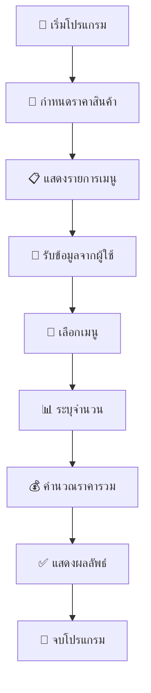

# ☕ Simple Cafe POS System

<div align="center">


**🎯 ระบบขายสินค้าร้านกาแฟอย่างง่าย**

*พัฒนาด้วยภาษา Python สำหรับการเรียนรู้และใช้งานจริง*

</div>

---

## 📋 รายละเอียดโปรแกรม

โปรแกรม **Simple Cafe POS** เป็นระบบจุดขายสินค้า (Point of Sale) อย่างง่ายที่ออกแบบมาเพื่อร้านกาแฟขนาดเล็ก ใช้งานง่าย เหมาะสำหรับผู้เริ่มต้นเรียนรู้การเขียนโปรแกรม

## ✨ คุณสมบัติเด่น

- 🍵 **แสดงรายการเมนู** - เมนูกาแฟครบครันพร้อมราคา
- 🛒 **รับออเดอร์** - รับคำสั่งซื้อจากลูกค้าอย่างง่ายดาย
- 💰 **คำนวณราคา** - คำนวณราคารวมอัตโนมัติ
- 📊 **รองรับหลายชิ้น** - สั่งซื้อสินค้าได้หลายจำนวน

## 📖 รายการเมนู

<div align="center">

| 🔢 เลขที่ | ☕ เมนู | 💵 ราคา (บาท) |
|:--------:|:------:|:------------:|
| **1** | 🇺🇸 Americano | **55.75** |
| **2** | 🥛 Latte | **60.15** |
| **3** | ⚡ Espresso | **50.15** |
| **4** | 🎨 Cappuccino | **65.00** |

</div>

## 🚀 วิธีการใช้งาน

```bash
# 1️⃣ รันโปรแกรม
python Cafe.py

# 2️⃣ เลือกเมนูที่ต้องการ (1-4)
# 3️⃣ ระบุจำนวนที่ต้องการสั่งซื้อ
# 4️⃣ ระบบจะแสดงราคารวมทั้งหมด
```

## 🎬 ตัวอย่างการใช้งาน

<div align="center">

```console
🎉 Welcome to the coffee shop!
กรุณาเลือกรายการที่ต้องการ
1. 🇺🇸 Americano 55.75 บาท
2. 🥛 Latte 60.15 บาท
3. ⚡ Espresso 50.15 บาท
4. 🎨 Cappuccino 65.00 บาท

👉 กรุณาเลือกเมนู (1-4): 2
📝 กรุณาระบุจำนวน: 3

💰 ราคารวมทั้งหมด: 180.45 บาท
🙏 ขอบคุณที่มาใช้บริการครับ
```

</div>

## 🏗️ โครงสร้างโค้ด

<div align="center">



</div>

### 📦 ส่วนประกอบหลัก

- 🏷️ **ตัวแปรราคา** - เก็บราคาของแต่ละเมนูกาแฟ
- 🖥️ **การแสดงผล** - แสดงรายการเมนูและราคาให้ลูกค้าเห็น
- ⌨️ **การรับข้อมูล** - รับการเลือกเมนูและจำนวนจากผู้ใช้
- 🧮 **การคำนวณ** - คำนวณราคารวมตามเมนูและจำนวนที่เลือก
- 📤 **การแสดงผลลัพธ์** - แสดงราคารวมและข้อความขอบคุณ

## 🔧 ความต้องการระบบ

<div align="center">

| 🛠️ เครื่องมือ | 📋 รายละเอียด |
|:----------:|:----------:|
| 🐍 **Python** | เวอร์ชัน 3.x ขึ้นไป |
| 📚 **ไลบรารี** | ไม่ต้องติดตั้งเพิ่มเติม |
| 💻 **OS** | Windows, macOS, Linux |

</div>

## 🚀 การพัฒนาในอนาคต

<div align="center">

| 🎯 ฟีเจอร์ | 📝 รายละเอียด | 🔥 ความสำคัญ |
|:--------:|:----------:|:----------:|
| 💳 **ระบบชำระเงิน** | รองรับการชำระเงินหลายช่องทาง | 🔥🔥🔥 |
| 📦 **จัดการสต็อก** | ตรวจสอบและจัดการสินค้าคงคลัง | 🔥🔥 |
| 👥 **ระบบสมาชิก** | สะสมแต้มและส่วนลดสำหรับสมาชิก | 🔥🔥 |
| 🧾 **พิมพ์ใบเสร็จ** | พิมพ์ใบเสร็จรับเงินอัตโนมัติ | 🔥 |
| 🏷️ **จัดการส่วนลด** | ระบบส่วนลดและโปรโมชั่น | 🔥 |

</div>

---

<div align="center">

## 👨‍💻 ผู้พัฒนา

**💡 โปรแกรมนี้พัฒนาด้วยภาษา Python**  
*🎯 เหมาะสำหรับการเรียนรู้และใช้งานจริงในร้านกาแฟขนาดเล็ก*

### 📞 ติดต่อ & สนับสนุน

[](https://github.com)
[](https://python.org)

**⭐ ถ้าชอบโปรแกรมนี้ อย่าลืมกด Star ให้ด้วยนะ!**

</div> 