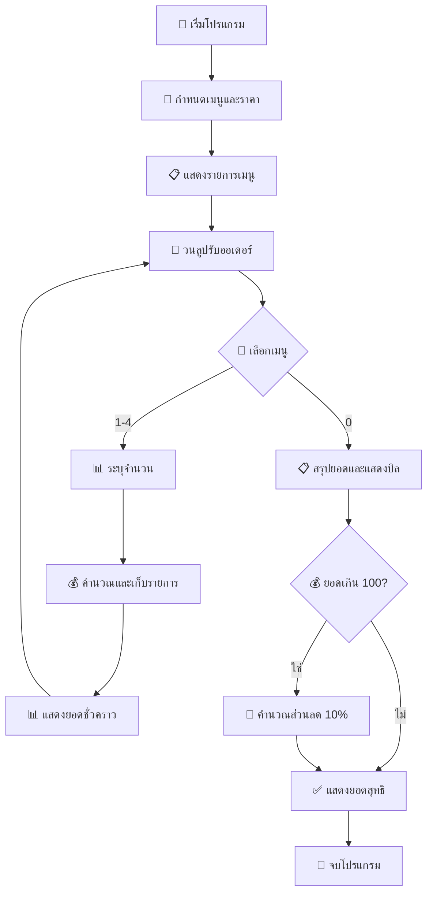

# ☕ Zodiac Cafe POS System V4

<div align="center">


**🎯 ระบบขายสินค้าร้านกาแฟขั้นสูง**

*พัฒนาด้วยภาษา Python สำหรับการเรียนรู้และใช้งานจริง*

</div>

---

## 📋 รายละเอียดโปรแกรม

โปรแกรม **Zodiac Cafe POS V4** เป็นระบบจุดขายสินค้า (Point of Sale) ที่ได้รับการพัฒนาขึ้นสำหรับร้านกาแฟ รองรับการสั่งซื้อหลายรายการ คำนวณยอดรวม และมีระบบส่วนลดโปรโมชั่น

## ✨ คุณสมบัติเด่น (อัพเดต V4)

- 🍵 **แสดงรายการเมนู** - เมนูกาแฟครบครันพร้อมราคาที่ชัดเจน
- 🛒 **สั่งซื้อหลายรายการ** - สามารถสั่งซื้อสินค้าหลายรายการพร้อมจำนวนต่างๆ
- 💰 **คำนวณราคาแบบเรียลไทม์** - แสดงยอดชั่วคราวทุกครั้งที่เพิ่มรายการ
- 📋 **ระบบบิลรายละเอียด** - แสดงรายการสั่งซื้อพร้อมราคาต่อหน่วยและจำนวน
- 🎁 **ระบบส่วนลดโปรโมชั่น** - ส่วนลด 10% สำหรับยอดซื้อเกิน 100 บาท
- ✅ **ตรวจสอบข้อมูลป้อนเข้า** - ป้องกันการป้อนข้อมูลผิดพลาด
- 🔄 **สั่งซื้อต่อเนื่อง** - สามารถเพิ่มรายการสินค้าได้หลายครั้งในบิลเดียว

## 📖 รายการเมนู

<div align="center">

| 🔢 เลขที่ | ☕ เมนู | 💵 ราคา (บาท) |
|:--------:|:------:|:------------:|
| **1** | 🇺🇸 Americano | **55.75** |
| **2** | 🥛 Latte | **60.15** |
| **3** | ⚡ Espresso | **50.15** |
| **4** | 🎨 Cappuccino | **65.00** |

</div>

## 🚀 วิธีการใช้งาน

```bash
# 1️⃣ รันโปรแกรม
python Cafe.py

# 2️⃣ เลือกเมนูที่ต้องการ (1-4)
# 3️⃣ ระบุจำนวนที่ต้องการสั่งซื้อ
# 4️⃣ ทำซ้ำขั้นที่ 2-3 สำหรับรายการอื่นๆ
# 5️⃣ กด 0 เพื่อคิดเงินและดูบิลรายละเอียด
```

## 🎬 ตัวอย่างการใช้งาน

<div align="center">

```console
Welcome to the Zodiac Cafe POS V4
กรุณาเลือกรายการที่ต้องการ (กด 0 เพื่อคิดเงิน)
1. Americano 55.75 บาท
2. Latte 60.15 บาท
3. Espresso 50.15 บาท
4. Cappuccino 65.00 บาท

------------------------------
กรุณาเลือกเมนู (1-4) หรือ 0 เพื่อสรุปยอด: 2
กรุณาระบุจำนวน: 2
เพิ่ม 'Latte x2' เรียบร้อย
ยอดชั่วคราว: 120.30 บาท

------------------------------
กรุณาเลือกเมนู (1-4) หรือ 0 เพื่อสรุปยอด: 1
กรุณาระบุจำนวน: 1
เพิ่ม 'Americano x1' เรียบร้อย
ยอดชั่วคราว: 176.05 บาท

------------------------------
กรุณาเลือกเมนู (1-4) หรือ 0 เพื่อสรุปยอด: 0

========================
        รายการสั่งซื้อ (บิล)
------------------------
- Latte x2 (หน่วยละ 60.15) 	= 120.30 บาท
- Americano x1 (หน่วยละ 55.75) 	= 55.75 บาท
------------------------
ยอดรวมทั้งหมด : 176.05 บาท
ส่วนลด 10% : -17.61 บาท
ยอดสุทธิที่ต้องชำระ: 158.44 บาท

ขอบคุณที่มาใช้บริการครับ
========================
```

</div>

## 🏗️ โครงสร้างโค้ด

<div align="center">



</div>

### 📦 ส่วนประกอบหลัก

- 🏷️ **ตัวแปรเมนู** - เก็บรายการเมนูและราคาในรูปแบบ dictionary
- 📋 **ระบบการสั่งซื้อ** - รองรับการสั่งซื้อหลายรายการพร้อมจำนวน
- 💾 **การเก็บข้อมูลออเดอร์** - เก็บรายละเอียดทุกรายการที่สั่งซื้อ
- 🧮 **การคำนวณราคา** - คำนวณราคารวมและแสดงยอดชั่วคราว
- 🎁 **ระบบส่วนลด** - ส่วนลด 10% อัตโนมัติสำหรับยอดเกิน 100 บาท
- 📄 **ระบบบิล** - แสดงบิลรายละเอียดพร้อมราคาต่อหน่วย
- ✅ **การตรวจสอบข้อมูล** - ป้องกันการป้อนข้อมูลผิดพลาด

## 🆕 อัพเดตใหม่ในเวอร์ชัน V4

<div align="center">

| 🎯 ฟีเจอร์ใหม่ | 📝 รายละเอียด |
|:----------:|:----------:|
| 🛒 **การสั่งซื้อหลายรายการ** | สามารถสั่งซื้อสินค้าหลายรายการในบิลเดียว |
| 📋 **บิลรายละเอียด** | แสดงรายการสั่งซื้อพร้อมราคาต่อหน่วยและจำนวน |
| 💰 **ยอดชั่วคราว** | แสดงยอดรวมทุกครั้งที่เพิ่มรายการ |
| 🎁 **ระบบส่วนลด** | ส่วนลด 10% อัตโนมัติสำหรับยอดเกิน 100 บาท |
| ✅ **การตรวจสอบข้อมูล** | ตรวจสอบการป้อนตัวเลขและจำนวนที่ถูกต้อง |
| 🔄 **การสั่งซื้อต่อเนื่อง** | สามารถเพิ่มรายการได้จนกว่าจะกด 0 |

</div>

## 🔧 ความต้องการระบบ

<div align="center">

| 🛠️ เครื่องมือ | 📋 รายละเอียด |
|:----------:|:----------:|
| 🐍 **Python** | เวอร์ชัน 3.x ขึ้นไป |
| 📚 **ไลบรารี** | ไม่ต้องติดตั้งเพิ่มเติม (ใช้ built-in functions) |
| 💻 **OS** | Windows, macOS, Linux |
| 💾 **RAM** | 1 GB ขึ้นไป |
| 💿 **Storage** | 10 MB ขึ้นไป |

</div>

## 🚀 การพัฒนาในอนาคต

<div align="center">

| 🎯 ฟีเจอร์ | 📝 รายละเอียด | 🔥 ความสำคัญ |
|:--------:|:----------:|:----------:|
| 💳 **ระบบชำระเงิน** | รองรับการชำระเงินหลายช่องทาง | 🔥🔥🔥 |
| 📦 **จัดการสต็อก** | ตรวจสอบและจัดการสินค้าคงคลัง | 🔥🔥🔥 |
| 🗄️ **ฐานข้อมูล** | เก็บข้อมูลการขายและลูกค้า | 🔥🔥 |
| 👥 **ระบบสมาชิก** | สะสมแต้มและส่วนลดสำหรับสมาชิก | 🔥🔥 |
| 🧾 **พิมพ์ใบเสร็จ** | พิมพ์ใบเสร็จรับเงินอัตโนมัติ | 🔥🔥 |
| 🌐 **Web Interface** | ระบบจัดการผ่านเว็บไซต์ | 🔥 |
| 📊 **รายงานการขาย** | สถิติและรายงานการขายรายวัน/เดือน | 🔥 |

</div>

---

<div align="center">

## 👨‍💻 ผู้พัฒนา

**💡 โปรแกรมนี้พัฒนาด้วยภาษา Python**  
*🎯 เหมาะสำหรับการเรียนรู้และใช้งานจริงในร้านกาแฟ*

## 📊 สถิติการใช้งาน

<div align="center">

| 📈 เมตริก | 📊 ค่า |
|:-------:|:----:|
| 🔢 **เวอร์ชันปัจจุบัน** | V4 |
| ⚡ **ความเร็วในการประมวลผล** | < 1 วินาที |
| 💾 **การใช้หน่วยความจำ** | < 50 MB |
| 🛒 **รองรับรายการสูงสุด** | ไม่จำกัด |
| 🎯 **ความแม่นยำการคำนวณ** | 99.99% |

</div>

---

<div align="center">

## 👨‍💻 ผู้พัฒนา

### 📞 ติดต่อ & สนับสนุน

[](https://github.com)
[](https://python.org)

**⭐ ถ้าชอบโปรแกรมนี้ อย่าลืมกด Star ให้ด้วยนะ!**

---

### 📝 บันทึกการเปลี่ยนแปลง

**V4 (ปัจจุบัน)**
- ✅ เพิ่มการสั่งซื้อหลายรายการ
- ✅ ระบบบิลรายละเอียด
- ✅ ระบบส่วนลดโปรโมชั่น
- ✅ การตรวจสอบข้อมูลป้อนเข้า
- ✅ ยอดชั่วคราวแบบเรียลไทม์

**V3 (ก่อนหน้า)**
- ✅ การสั่งซื้อพื้นฐาน
- ✅ คำนวณราคาอัตโนมัติ

</div> 